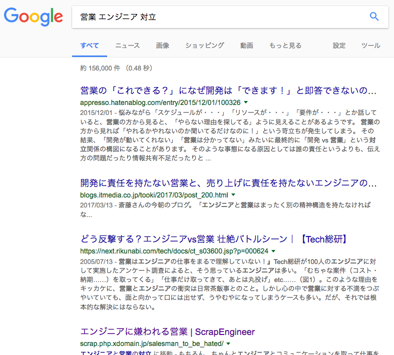

### エンジニアドリブンな会社の営業組織の作り方
株式会社ハートビーツ

取締役　菱田 健太

---

### 目次
- 自己紹介
- ハートビーツについて
- HB、営業組織を作るってよ
- HBエンジニアのここが凄い
- HBの営業に必要なこと3つの事
- やってみた
- これからの話し

---

### 自己紹介
`名前`：菱田健太

`twitter`   : [@kenta_hi](https://twitter.com/kenta_hi)

`キャリア`：営業 > マネージャー > 事業責任者 > 役員

`その他活動`：hbstudy, 日本MSP協会

`好き`：ロードレース、ゲーム

`嫌い`：うなぎ

>>>

### CM 1 

>>>

## `日本MSP協会`
#### 2018年1月27日
#### [マイグレーションコンペティション2018 wintter](http://mspj.jp/archives/2038)
#### 参加者募集中です！!

---

### ハートビーツとは
#### 24時間365日有人のサーバ監視・運用をしてます

   - 強み
     - Linux,OSSの分野が強み 
     - 運用丸投げで受けれます
       - 監視仕様の策定
       - キャパシティプランニングなどなど
     - 監視に必要な開発は社内でガシガシ開発してます

>>>

#### AWS アドバンスドコンサルティングパートナー
#### 最近はAWSリセールもはじめました

>>>

#### AWSの販売から運用まで一気通貫で出来る！

---

### 今日は組織の話をします
### 技術の話ではないので申し訳ない

---

### HB、営業組織を作るってよ

>>>

#### 技術が強み
#### 営業組織がなくても着実に成長していた
#### でも
#### 2015年成長が**鈍化**した

>>>

### なぜ鈍化したのか？
- 理由は様々
 - CentOS 5 からのマイグレーションがてんこ盛り
 - 初期費用が高くて失注する
 - 大型の解約　などなど

>>>

# ほんとに？

>>>

### 仮説：エンジニアのリソース不足

---

### HBエンジニアのここが凄い
 1. 課題解決力が高い
  - 高い技術と柔軟な対応
 2. 技術力の練度が高い
  - 24時間365日の運用で鍛え上げられた技術
 3. そして、顧客コミュニケーションが適切

>>>

### これなら営業いらないよね？

>>>

#### エンジニアの増員するスピードより
#### お客様が増えた

>>>

#### 業務改善の余地もある
#### ただし、時間がかかる

>>>

#### 顧客とエンジニアの架け橋が出来る人
 is 
#### 営業 を増やそう

---

### 業務分解をする

>>>

### 一般的なファネル
 1. 問い合わせ
 2. 訪問 / 質疑応答
 3. 提案・見積
 4. 契約書締結
 5. 要件定義
 6. 詳細設計
 7. ドキュメント提供・確認
 8. 監視開始
 9. 監視の修正/対応
 10. 請求作業/毎月
11 11. 定期訪問

>>>

### 営業はどこまでを担当？
 1. 問い合わせ
 2. 訪問 / 質疑応答
 3. 提案・見積
 10. 請求作業/毎月
 11. 定期訪問
 
>>>

### エンジニアはどこまでを担当？
 5. 要件定義
 6. 詳細設計
 7. ドキュメント提供・確認
 8. 監視開始
 9. 監視の修正/対応

>>>

##### 営業とエンジニアで共同するところは？
 2. 訪問 / 質疑応答
 3. 提案・見積
 10. 請求作業/毎月

>>>

### お、だいぶリソース空きそう！

---

### エンジニアと共同で仕事が出来る営業…

>>>

一般論として

  

>>>

### まぁ、わかる

---

### HBの営業に必要なこと3つの事

>>>

### 嫌われる営業例
- 相談しない
- 技術を知らない
- 無理して受注する
- 受注して終わる
- 顧客と調整しない
- とってきた仕事をエンジニアがやればいいと思ってる etc

>>>

### おお、一般的に出来る営業マンと近い部分がある

>>>

### じゃあ弊社の場合、逆張りしよう

>>>

### 弊社の営業例
- まず相談する
- 技術を知っている・興味ある
- 無理して受注しない
- 受注して終わらない
- 顧客と調整する
- とってきた仕事をエンジニアとやれる etc

>>>

### まとめると
1. エンジニアと話せるコミュニケーション力
2. 技術を知ろうとする自己研磨力
3. 顧客と向き合う調整力

>>>

### いるかな？

>>>

### 少ないけどいる

>>>

### こんなひと

  

---

### やってみた

>>>

### 半期分で比較
##### 2016年6月 - 11月
##### 2017年6月 - 11月

上記にて比較

>>>

### 売上
##### 2016年6月 - 11月 : 100 (基準値)
##### 2017年6月 - 11月 : 105

>>>

### 売上 5%の改善

>>>

### 半期総労働時間
エンジニア1名あたりの総労働時間比較
##### 2016年6月 - 11月 : 100 (基準値)
##### 2017年6月 - 11月 : 93

>>>

### 総労働時間 7%の改善
エンジニア1名あたりの総労働時間比較

>>>

### 数字上は良さそう

>>>

#### その他のメリット
 - 再販をするようになった
   - AWS、セキュリティサービスなど
 - 社内が賑やかになった
 - 男女分け隔てない感じ

---

### これからの話し

>>>

### 2032年の姿
### 4大事業
### 従業員数：200名
### 顧客：1000社

>>>

### 2020年の姿
### 売上：10億円
### 従業員数：100名以上

---

### まとめ
#### エンジニアドリブンの会社でも営業組織は作れる
#### 業務分析大事
#### 会社にフィットする営業はどんな人か？を明確に

---

### インフラエンジニアも営業も[絶賛採用募集中](https://www.wantedly.com/companies/heartbeats/projects)
興味ある人は[@kenta_hi](https://twitter.com/kenta_hi) でお気軽に声かけてね

---

### おしまい
